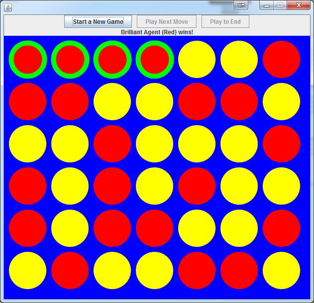
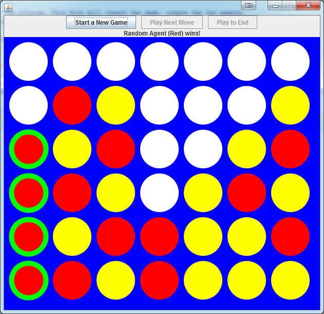
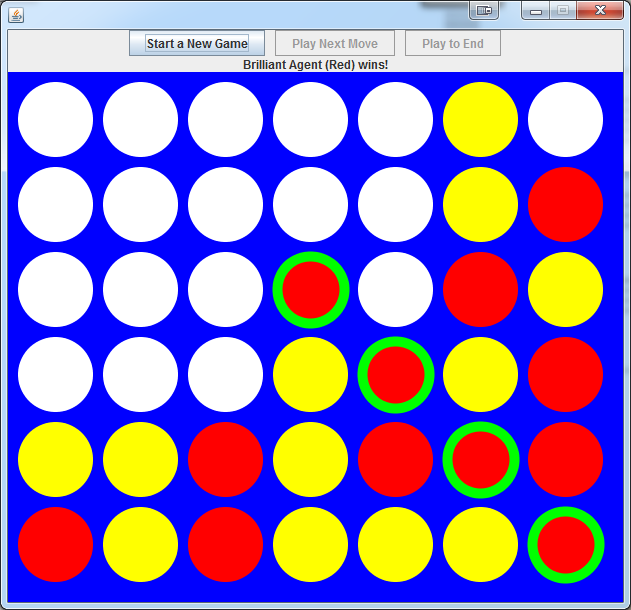
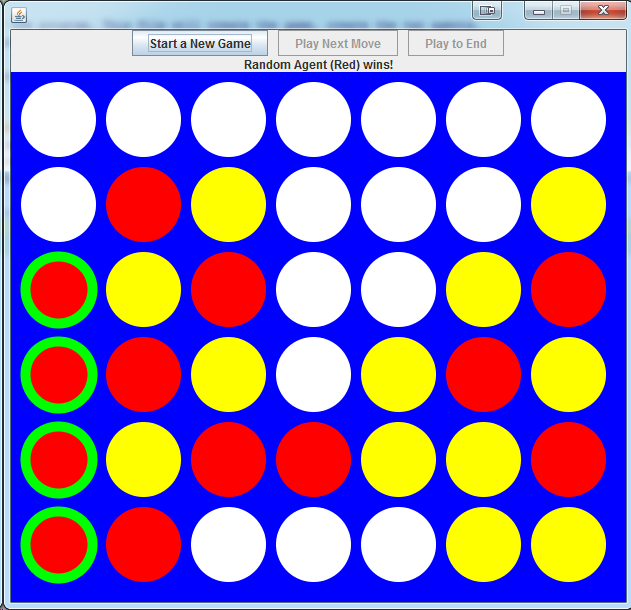
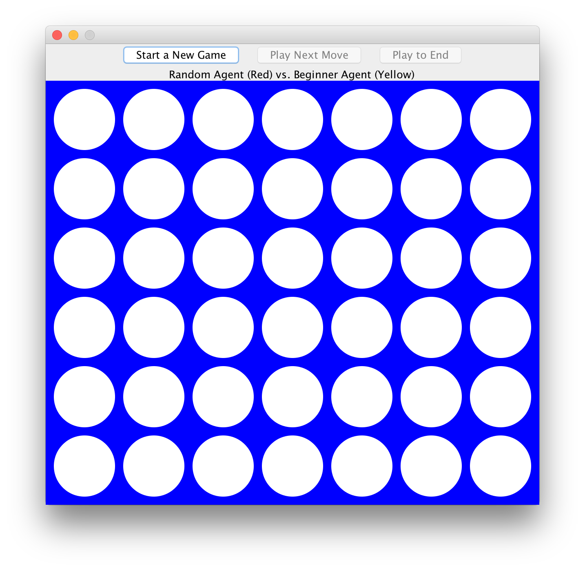

# Connect 4 Agent
In this project, your task is to create an agent (a game player) that can play Connect 4. Connect 4 is a popular board game, similar to an extended version of Tic-Tac-Toe. Note that all of the graphical components (e.g., game board, pieces, etc.) you will need for this project have already been created for you, so you will not need to build any yourself. You will only need to implement your agent’s game-playing logic.

**[Rules of the Game](#rules-of-the-game)** 
**[The Project Architecture](#the-project-architecture)** 
**[Designing Your Agent](#designing-your-agent)** 
**[Playing Your Agent](#playing-your-agent)** 
**[Further Reading](#further-reading)** 

# Rules of the Game
Connect 4 involves two players, a ‘red’ player and a ‘yellow’ player, playing against each other. The game is played on a vertical grid with six rows and seven columns. The players take turns placing pieces of their color, called ‘tokens’, into the board. The goal of each player is to get four of his or her tokens in a row in the board, either horizontally, vertically, or diagonally. For example, below are three winning arrangements of pieces from the game you will be using.

  Connect 4 is played on a vertical board, meaning that pieces are “dropped” into the board. So, players may only ever place their token in the top unfilled slot in a column. The above three are examples of valid boards because no token is located above an
empty slot. The board below would be an invalid board because there are empty slots beneath some of the tokens:

# The Project Architecture
[Connect4 API](https://jd12.github.io/connect-4-student/)

The architecture for the game is given to you. You will not need to modify any of these classes (other than Main.java), although you’re welcome to do so if you have any ideas on how to change or improve it, but you will use methods within them. You should browse the code/API and look at how the different components fit together. Briefly, however, the project is made of seven main classes:
- Main.java: the main driver class. If you want to switch which agents are playing, you should modify this class. Otherwise, you won’t need to worry too much about this class.
- Connect4Game.java: the object that stores the current status of the game. Your agent will be interacting with the Connect4Game object to look at the current status of the game and make its moves. Connect4Game stores the game board as a list of Connect4Columns.
- Connect4Column.java: the object that stores a single column of the game board. A Connect4Column stores a list of Connect4Slots, from the top to the bottom. The first slot in the list is the top slot, and the last slot is the bottom slot.

- Connect4Slot.java: the object that stores a single slot in the game board. A slot can be either filled by a token or empty; if a slot is empty, no other slots above it can be filled. If a slot is filled, it is filled by either a red token or a yellow one.
- Agent.java: the abstract class** that gives the actions that every agent must be able to perform. Generally, every agent must have a name and must be able to move in the game; in other words, the agent must be able to add a piece to the game board.
- Connect4Frame.java: the class that creates the window that shows the game. The Connect4Frame object also runs the game engine. You should not need to worry about how Connect4Frame works, but you are free to look if you are curious.
- Connect4Panel.java: the class that shows the current game itself. Similarly, you should not need to worry about how it works, but you are free to look if you are curious.  

** Think of the abstract class as a Super Class that we cannot create an instance of. It can be seen as a combination of an Interface and a Super Class. You can learn more here: http://docs.oracle.com/javase/tutorial/java/IandI/abstract.html

For your project, you will build out MyAgent.java, a subclass of Agent.java.

# Designing Your Agent
A template for your agent has already been given to you in the form of MyAgent.java. MyAgent.java is equipped with a few methods and pointers to get you started.
First, we have supplied your agent with five methods that you may find useful:
- moveOnColumn(int columnNumber): When your agent decides to place a piece
on the board, it should choose which column to place the piece into; the piece should then fall to the top empty slot in that column. The moveOnColumn method will take care of this. So, your agent should call moveOnColumn once during the execution of its move() method, which you’ll learn more about below.
- getLowestEmptyIndex(Connect4Column column): To know where a token will go if it’s dropped into a column, we have to know where the top empty slot in that column is. This method will return the index of the lowest empty slot in the column. (Hint: this method might be useful for other tasks as well!)
- MyAgent(Connect4Game game, boolean iAmRed): We have supplied a default constructor for your agent. If you want to do any other set-up in your agent before it starts to play, you can do it here.
- randomMove(): Sometimes, especially early in the game, any move might seem just as good as any other. If your agent can’t decide on a move on its own, it might be okay to just move randomly by getting the column for a random valid move out of this method. Implementing an agent that just moves randomly is also a great way to get started, and you can make incremental improvements from there!
- getName(): Every agent must have a name. Right now, your agent is named “My Agent”, but feel free to change it! Feel free also to try out different agents and name them different things.

In addition to the above methods, we’ve also provided the headers for three other methods. You will need to complete at least the move() method for your agent to work; the other two are recommended to get you started on building a good agent.
- move(): Every agent must have a move method. This method is called every time it’s the agent’s turn to move in the game. When the move method is called, the agent should look at the game board, decide on the move, and execute the move using the moveOnColumn method. If your agent moves illegally (skips its turn, adds multiple pieces, or removes an earlier piece), the game will let you know that has occurred and end the game.
- iCanWin(): One basic behavior that an intelligent Connect 4 agent would do is to play a winning move when it can. This method, if you decide to implement it, would return which column currently holds a winning move for the agent, or -1 if no such column exists.
- theyCanWin(): Another basic behavior that an intelligent Connect 4 agent would do is to block its opponent from playing a winning move. This method, if you decide to implement it, would return which column the agent should play in to block an opponent’s winning move, or -1 if no such column exists.

You are, of course, free and encouraged to write your own methods as well! You can even write additional classes if you would like to in order to help your agent play Connect 4 as well as it can.

# Playing Your Agent
Once you have an agent that can play the game, go to Main.java and set one (or both) of the players in the game to your agent. This will allow your agent to play the game. Then, run Main, and you’ll be able to watch your agent play.

You can also run the test suite to see if it can beat the RandomAgent and BeginnerAgent 9 out of 10 times on average. Sometimes the test will timeout and you'll get a red x. Try running the test again until you either get a blue x or green check. If you run the tests 3-5 times and each time you're getting a red x, then something is probably wrong with your code.

## Important
When you run the game, you will see the screen below:

This screen is made of a number of parts:
- Start a New Game: the Start a New Game button will clear the board and randomly decide on which player should play next in the next round.

- Play Next Move: once a game has been started, clicking Play Next Move will play one move in the game. This lets you trace through and watch the agents move-by-move.
- Play to End: clicking Play to End will fast-forward the game to the end, when either one of the players wins, the game board is filled without either playing winning, or one of the players breaks the rules.
- Status Label: below the three buttons is a status label that describes the current state of the game. It will either say whose turn it is or why the game has ended.
- The Game: the game itself is displayed as a 7x6 grid of slots. Each slot can be either white (empty), red (red token), or yellow (yellow token). When a player has won, the winning move will be outlined in green.

We have supplied a selection of opponents for your agent to play against as well. To play against these agents, modify Main.java to declare the red or yellow players as whichever agent you want your agent to play against. These agents increase in difficulty, so you’ll have to build better and better agents to beat them. Don’t worry if you can’t beat them all, some of them are very challenging. Generally, if your agent can reliably (9 times out of 10) beat the Random and Beginner agents, you’ve implemented a pretty smart agent. If your agent can reliably beat one of the harder agents, you’ve done an incredible job!

# Summary

Your task is to complete MyAgent.java by building out the necessary methods and properly calling any other supplied methods so that your agent can beat a Random Agent and a Beginner Agent at least 9 out of 10 times. Coming up with the correct logic may take a couple of tries as you test your agent against more and more agents.

To get started, review information found above. Then, open up the Project and take a look through the code and comments supplied in each class. Write up the logic required for your agent to play a game in pseudo-code. Translate that into actual code and get playing!

# Further Reading
Designing an agent to play Connect 4 is not just a toy project for an Introduction to Java class; it was actually a significant problem in the AI field for many years! With 42 slots each of which can be occupied by one of two colors, there are over 4.5 trillion different possible final outcomes of a Connect 4 game. Before computers reached their modern power, this was too many possible outcomes to analyze via a “brute force” method of simply trying every possible combination. Instead, AI scientists had to try to prove mathematically that there exists a strategy that can guarantee success in a game of Connect 4.

In 1988, James Dow Allen and Victor Allis both solved the game. This means that there is a strategy that an agent can play that guarantees that no matter what its opponent does, the agent is guaranteed to win. The first move of this strategy is to play in the center column, but beyond that, the strategy is incredibly complicated. If you are interested, you can read more about the process of designing an agent to play Connect 4 perfectly, as well as the solution itself, with the following readings:

Allen, J. D. (2010). The Complete Book of Connect 4: History, Strategy, Puzzles. Puzzle Wright Press.

Allis, L. V. (1988). A knowledge-based approach of connect-four. Vrije Universiteit, Subfaculteit Wiskunde en Informatica.

Edelkamp, S., & Kissmann, P. (2011). On the complexity of BDDs for state space search: A case study in Connect Four. PUZZLE, 2, 1.
